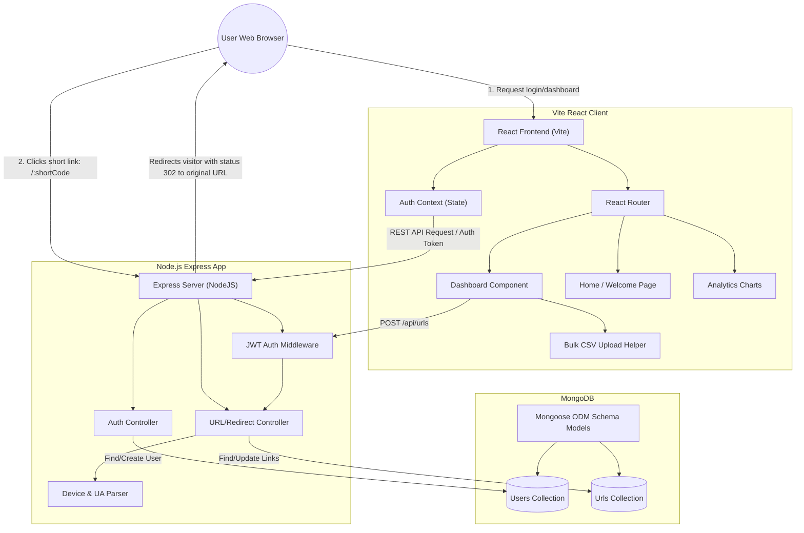

# 🔗 LinkSnip — Katomaran Hackathon 2026

LinkSnip is a premium, secure, high-performance URL shortener application. Built with modern visual aesthetics (curated colors, smooth animations, card hover effects) and structured layout paradigms, the application enables authenticated users to manage and optimize links, generate download-ready vector QR codes, perform batch URL processing, and monitor visitor statistics using interactive real-time dashboards.

**⚡ Live Application:** [https://linksnip-kavi.netlify.app](https://linksnip-kavi.netlify.app)

---

## 📅 AI App Building Workflow & Planning Document

This application was structured and developed using a systematic, step-by-step AI-assisted design workflow. Below is the documentation of each planning phase.

### 1. App Conception & Requirements Gathering
The goal was to design a developer-friendly, marketing-oriented URL shortener dashboard that does not feel like a bare Minimum Viable Product (MVP), but rather a premium tool (similar to Bitly or Dub.co). 
* **Key Requirements:**
  * Secure auth framework (sign up, log in, token-based requests).
  * URL shortening with custom slug aliases.
  * Time-based link expiration schedules.
  * Tracking of click rates, device, OS, browser, and timestamp logs.
  * Clean charts mapping daily trends.
  * Bulk operations (uploading up to 50 URLs via CSV).
  * Standalone public analytics pages for sharing metrics safely.
  * Auto-generation of client-downloadable QR codes.

### 2. Database Schema & Architecture Design
* Refined schema relations: A `User` schema storing passwords encrypted with salt hashes, and a `Url` schema containing target urls, redirect codes, and embedded visitor log subdocuments (`visits`) to minimize complex database joins on heavy redirect traffic.
* Database indexing: Configured fast compound lookup indexes on `shortCode` and owner reference fields (`user`).

### 3. API Routing Design
* Modular routing architecture splitting authentication operations (`/api/auth`), URL management (`/api/urls`), and root wildcard redirections (`/:shortCode`).
* Developed JWT authorization middleware protecting endpoint CRUD scopes.

### 4. Frontend Component Development & Visual Identity
* Set a modern, premium design palette: deep indigo background gradients, smooth card scale animations, responsive custom sidebar navigation, and loading states.
* Configured Recharts bar and line graphs to cleanly display daily trends and system metrics.

---

## 📐 Architecture Diagram

Below is the conceptual visual architecture of LinkSnip, mapping the interaction between the React SPA client, the Express Node backend, the Mongoose models, and MongoDB.



---

## ✨ List of Features & Functionalities

LinkSnip supports the following fully-implemented functionalities:

1. **User Security Center:**
   * Signup and Login forms with validation warnings.
   * JWT-signed authorization token stored locally inside `localStorage` for persistent sessions.
   * Route shielding: Only logged-in users can view dashboards, analytics, and home statistics.

2. **Advanced Single URL Shortening:**
   * Shortens long destination endpoints into compact 7-character custom hashes.
   * Supports **Custom Aliases** allowing users to create branded redirects (e.g., `/summer-promo` instead of randomized strings).
   * **Link Expiration:** Integrated date-picker lets you schedule a future deactivation date for links.
   * Status toggling: Active/Inactive links can be toggled manually by owners at any time.

3. **Analytics Core:**
   * Tracks visitor metrics automatically on redirect: Timestamp, IP address, Device Type (Mobile/Desktop/Tablet), Browser version, Operating System, and HTTP Referrer.
   * **Interactive Dashboards:** Visual representations using customized charts (Recharts) mapping:
     * Visitor browsers (Chrome, Safari, Firefox, Edge, etc.)
     * Device types (Desktop, Mobile, Tablet)
     * Operating systems (Windows, macOS, iOS, Android, Linux)
     * Clicks over the last 7 days (Traffic timelines)

4. **Public Statistics Sharing:**
   * Standalone public stats page at `/stats/:shortCode` allowing developers to share click success rates and analytics visually with clients or partners without exposing private account dashboards.

5. **QR Code Generator:**
   * Dynamic base64 PNG vector QR codes auto-generated for each URL.
   * Native click-to-download feature for sharing.

6. **Bulk CSV Processor:**
   * Streamlined file drop zone allowing batch shortening of up to 50 links in a single file upload.

---

## ⚙️ Setup Instructions

Follow these steps to configure and boot the application locally:

### Prerequisites
* **Node.js** v18 or newer.
* **MongoDB Community Server** installed and running on port `27017` (or a remote Atlas Mongo URI).

### Step 1: Clone and Enter the Project
```bash
git clone https://github.com/kaviyarasu2905/url-shortener.git
cd url-shortener
```

### Step 2: Backend Installation & Configuration
1. Navigate to the backend folder:
   ```bash
   cd backend
   ```
2. Install dependencies:
   ```bash
   npm install
   ```
3. Copy environment configuration:
   ```bash
   cp .env.example .env
   ```
4. Verify or adjust the environment keys in `.env`:
   ```env
   PORT=5000
   MONGO_URI=mongodb://localhost:27017/urlshortener
   JWT_SECRET=your_super_secret_key
   BASE_URL=http://localhost:5000
   CLIENT_URL=http://localhost:5173
   ```
5. Spin up the server in development mode:
   ```bash
   npm run dev
   ```

### Step 3: Frontend Installation & Launch
1. Open a new terminal and navigate to the frontend folder:
   ```bash
   cd ../frontend
   ```
2. Install packages:
   ```bash
   npm install
   ```
3. Boot up the Vite local server:
   ```bash
   npm run dev
   ```
4. Access the frontend app in your browser at `http://localhost:5173`.

---

## 🤔 Assumptions Made

* **Authentication Required:** Anonymous or guest shortening is disabled. Users must have a secure, registered account to instantiate link creations.
* **Dynamic Analytics Parsing:** User-Agent headers are dynamically parsed on the Express server side when the `/redirect` route executes to extract system, browser, and device metrics.
* **Unique Slugs:** Both randomized hashes and custom aliases share a global uniqueness index constraint inside MongoDB.
* **Client and Server Decoupling:** The application follows a headless REST structure, making it highly scalable and ready to run on separate server/frontend instances (like Netlify and Render).

---

## 📊 Sample Output & Database Structures

Below are examples of standard database records, server start logs, and API redirect activity logs generated by LinkSnip.

### 1. Database Entry Example (`Urls` collection)
```json
{
  "_id": "60d5ecb7b4cd9c0015a1f6a1",
  "user": "60d5eb28b4cd9c0015a1f6a0",
  "originalUrl": "https://react.dev/reference/react",
  "shortCode": "react-ref",
  "customAlias": "react-ref",
  "clicks": 1,
  "visits": [
    {
      "timestamp": "2026-06-13T12:25:00.000Z",
      "ip": "127.0.0.1",
      "userAgent": "Mozilla/5.0 (Windows NT 10.0; Win64; x64) AppleWebKit/537.36 (KHTML, like Gecko) Chrome/120.0.0.0 Safari/537.36",
      "device": "desktop",
      "browser": "Chrome",
      "os": "Windows"
    }
  ],
  "expiresAt": null,
  "isActive": true,
  "createdAt": "2026-06-13T12:24:00.000Z",
  "updatedAt": "2026-06-13T12:25:00.000Z",
  "__v": 1
}
```

### 2. Node.js Express Server Startup Logs
```text
[nodemon] starting `node server.js`
MongoDB Connected successfully
Server running in development mode on port 5000
```

### 3. Redirection API Console Logs
```text
[GET] /react-ref - Incoming redirect request from 127.0.0.1
Parsed User-Agent: Chrome / Windows / desktop
Click incremented successfully for code: react-ref. Performing redirect 302 to https://react.dev/reference/react.
```

---

## 🎥 Demonstration Video

[Watch the full application walkthrough on YouTube](https://youtu.be/4wRd57o0U5k?si=vu_N2-o9-hSfSHvW)

---

This project is a part of a hackathon run by https://katomaran.com
